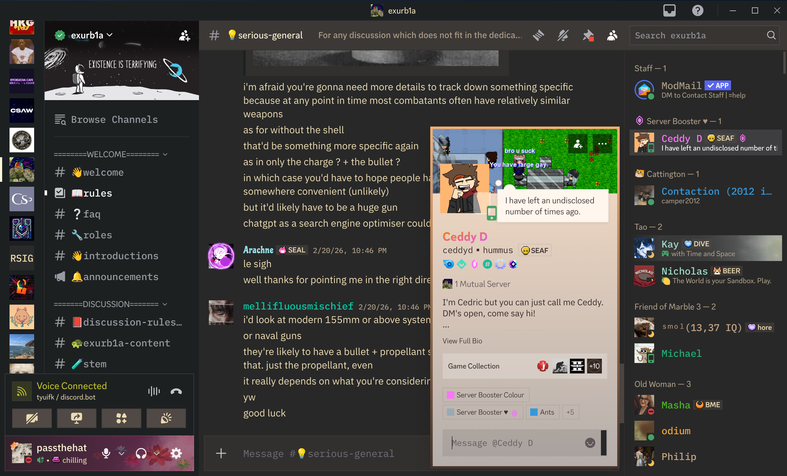

# Gruvbox Sharp

> Gruvbox Dark Soft palette - sharp corners - IBM Plex typography

A BetterDiscord / Vencord theme built on the [Gruvbox](https://github.com/morhetz/gruvbox) Dark Soft palette. IBM Plex Mono UI, IBM Plex Sans message content area. Sharp edges everywhere possible.

---

## Preview



---

## Colour Palette

| Token | Hex | Role |
|---|---|---|
| `bg_hard` | `#1d2021` | User panel, code block background |
| `bg0_s` | `#32302f` | Primary chat surface |
| `bg0` | `#282828` | Sidebar, input background |
| `bg1` | `#3c3836` | Elevated surfaces: popouts, modals, header |
| `bg2` | `#504945` | Borders, selected state |
| `fg0` | `#f9f5d7` | Headings, active text |
| `fg1` | `#ebdbb2` | Normal body text |
| `fg4` | `#a89984` | Muted / channel names |
| `yellow` | `#d79921` | Brand accent (replaces blurple) |
| `y_bright` | `#fabd2f` | Accent hover |
| `blue_b` | `#83a598` | Links |
| `aqua_b` | `#8ec07c` | Speaking ring, positive accent |
| `red_b` | `#fb4934` | Danger text, notification badges |
| `green_b` | `#b8bb26` | Online status indicator |

---

## Installation

### BetterDiscord

1. **Enable Dark Mode first** — Settings -> Appearance -> Theme -> Dark
2. Download [`GruvboxDarkSharp.theme.css`](https://betterdiscord.app/Download?id=ADDON_ID_HERE)
3. Move the file to your BetterDiscord themes folder:
   - **Windows:** `%AppData%\BetterDiscord\themes\`
   - **macOS:** `~/Library/Application Support/BetterDiscord/themes/`
   - **Linux:** `~/.config/BetterDiscord/themes/`
4. Open Discord -> Settings -> Themes -> Enable **GruvboxDarkSharp**

### Vencord (Online Themes)

1. Open Discord -> Settings -> Vencord -> Themes -> Online Themes
2. Paste the following URL and press Enter:

```
https://raw.githubusercontent.com/round-panda/gruvbox-sharp/main/GruvboxSharp.theme.css
```

### Vencord (Local)

Download the file and place it in your Vencord themes directory, then enable it under Settings -> Vencord -> Themes.

---

## Customisation

All palette values are CSS custom properties defined once in `:root`. To adjust a colour, override any `--grv-*` variable in Discord's Quick CSS editor — no need to edit the theme file directly.

```css
/* Example: swap the accent from yellow to a warm orange */
:root {
    --grv-yellow:   #d65d0e;
    --grv-y-bright: #fe8019;
}
```
---

## Compatibility

| Client | Status |
|---|---|
| Vesktop | Tested |
| BetterDiscord | Tested |
| Vencord | Likely works |
| Stylus (browser) | Likely partial styling |

Discord updates its internal CSS class names frequently. If something breaks, please open an issue.

---

## Reporting Issues

Please use the [issue tracker](https://github.com/round-panda/retro-discord-sharp/issues). Include:
- Your Discord version (Help -> About)
- Your BetterDiscord / Vencord / Vesktop version
- A screenshot of the broken element
- The class name of the element if possible (Ctrl + Shift + I)
