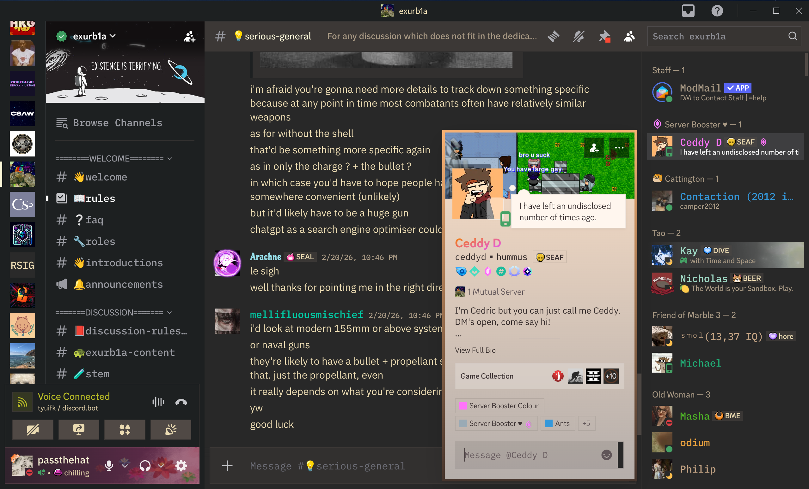

# Gruvbox Sharp

> Gruvbox Dark Soft palette - sharp corners - IBM Plex typography

A BetterDiscord / Vencord theme built on the [Gruvbox](https://github.com/morhetz/gruvbox) Dark Soft palette. IBM Plex Mono UI, IBM Plex Sans message content area. Sharp edges everywhere possible.

---

## Preview



A soft version of this Gruvbox theme is also offered at `https://raw.githubusercontent.com/round-panda/gruvbox-sharp/main/GruvboxSoft.theme.css`; the same instructions below apply, but to the aforementioned file.

---

## Installation

### BetterDiscord

1. **Enable Dark Mode** — Settings -> Appearance -> Theme -> Dark
2. Download `GruvboxSharp.theme.css`
3. Move the file to your BetterDiscord themes folder:
   - **Windows:** `%AppData%\BetterDiscord\themes\`
   - **macOS:** `~/Library/Application Support/BetterDiscord/themes/`
   - **Linux:** `~/.config/BetterDiscord/themes/`
4. Open Discord -> Settings -> Themes -> Enable **GruvboxSharp**

### Vencord (Online Themes)

1. Open Discord -> Settings -> Vencord -> Themes -> Online Themes
2. Paste the following URL and save:

```
https://raw.githubusercontent.com/round-panda/gruvbox-sharp/main/GruvboxSharp.theme.css
```

### Vencord (Local)

Download the file and place it in your Vencord themes directory, then enable it under Settings -> Vencord -> Themes.

---

## Colour Palette

| Token | Hex | Role |
|---|---|---|
| `bg_hard` | `#1d2021` | User panel, code block background |
| `bg0_s` | `#32302f` | Primary chat surface |
| `bg0` | `#282828` | Sidebar, input background |
| `bg1` | `#3c3836` | Elevated surfaces: popouts, modals, header |
| `bg2` | `#504945` | Borders, selected state |
| `bg3` | `#665c54` | Muted icons, disabled borders |
| `fg0` | `#f9f5d7` | Headings, active text |
| `fg1` | `#ebdbb2` | Normal body text |
| `fg2` | `#d5c4a1` | Secondary/subtle text |
| `fg4` | `#a89984` | Muted / channel names |
| `yellow` | `#d79921` | Mention foreground, mention bar |
| `yellow_b` | `#fabd2f` | Warning text, idle status |
| `blue_b` | `#83a598` | Brand accent (replaces blurple), links, reactions |
| `blue_dark` | `#076678` | Button fills, pill indicators |
| `aqua_b` | `#8ec07c` | Speaking ring, voice chrome |
| `red` | `#cc241d` | Danger button base |
| `red_b` | `#fb4934` | Danger text, notification badges |
| `purple_b` | `#d3869b` | Syntax highlight: keywords/variables |
| `green_b` | `#b8bb26` | Online status, positive/success indicators |

---

## Compatibility

Only tested for Vesktop.

Discord updates its internal CSS class names frequently. If something breaks, please open an issue.
